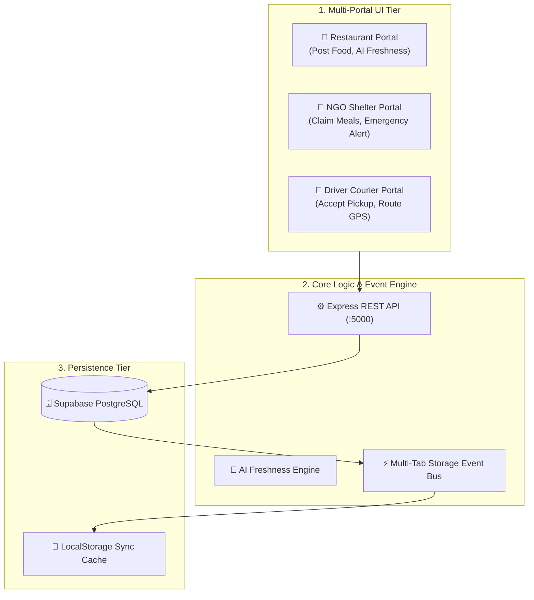

# 🍲 Surplus-To-Shelter: Real-Time Smart Food Rescue Network

> **Connecting Surplus Food Donors, NGO Shelters, and Courier Drivers with AI-Powered Freshness Scoring & Real-Time Logistics.**


---

## 📌 Problem Statement & Vision

Millions of tons of edible, high-quality surplus food from restaurants, hotels, and caterers are discarded daily into landfills, generating harmful methane emissions. Meanwhile, urban community shelters and NGOs face critical daily meal shortages.

**Surplus-To-Shelter** bridges this gap by creating an automated, zero-latency food rescue ecosystem. It connects **Restaurants** (food donors), **NGOs/Shelters** (recipients), and **Courier Drivers** (logistics network) in real time.

---

## 🌟 Key Features

### 1. 🧠 AI Food Freshness & Expiry Risk Score
- Automatically calculates a safety risk score (e.g. `98/100 Tier A`) based on preparation timestamp, food category, ambient temperature, and shelf-life metrics before dispatch.

### 2. ⚡ Real-Time Multi-Portal Synchronization
- Built with a 3-tier data sync engine: **Supabase PostgreSQL Cloud DB → Express REST API → LocalStorage Offline Cache**.
- Actions taken in the Restaurant portal immediately broadcast live across NGO and Driver portals without manual page refreshes.

### 3. 🚨 Emergency Relief Red Alert System
- Allows NGOs to trigger high-priority crisis requests (*e.g., Heavy Rain & Flood Emergency*) that deploy immediate red-alert banners across all connected restaurant & driver dashboards.

### 4. 🚚 Driver Courier Portal & IoT Cold-Chain Monitoring
- Driver mission tracking with turn-by-turn navigation preview.
- Telemetry reporting for insulated container temperature (`4.2°C` safe standard), thermal seal verification, and GPS tracking.

### 5. 📊 Real-Time Environmental & Social Impact Analytics
- Live tracking of **Total Meals Rescued**, **CO₂ Emissions Prevented (kg)**, **Water Waste Saved (Litres)**, and **Economic Value Generated (₹)**.

---

## 💰 Business & Driver Monetization Model

| Payout Stream | Funding Source | Payout Structure | Driver Benefit |
| :--- | :--- | :--- | :--- |
| **Base Pickup Fee** | Corporate CSR & ESG Grants | ₹50 – ₹80 per delivery | Guaranteed base pay for every trip |
| **Distance Allowance** | Restaurant Logistics Subscription | ₹10 / extra km | Covers fuel & vehicle maintenance |
| **Emergency Bonus** | Red Alert Relief Budget | +₹50 bonus per response | Incentivizes rapid response during crises |
| **Green Miles Bonus** | Carbon Credit Subsidies | Eco-Points / Gas Coupons | Extra earnings for EV / zero-emission deliveries |

---

## 🏗️ System Architecture



---

## 📁 Repository Directory Structure

```text
Shelter/
├── index.html                     # Central Portal Switcher & Auth Gateway
├── restaurant-dashboard.html      # Restaurant Main Dashboard
├── restaurant-post.html           # Surplus Food Posting Form (AI Freshness)
├── restaurant-matching.html       # Smart AI NGO Matching Engine
├── restaurant-donations.html      # Active Restaurant Donation Feed
├── restaurant-pickups.html        # Live Driver Dispatch Tracking
├── restaurant-notifications.html  # Alerts & Emergency Crisis Feed
├── ngo-dashboard.html             # NGO Shelter Claiming & Intake Dashboard
├── driver-dashboard.html          # Driver Active Mission & Navigation
├── driver-available.html          # Driver Open Pickup Market
├── driver-route.html              # Turn-by-Turn Mission Route
├── db-viewer.html                 # Supabase & Local Database Inspector
├── css/
│   └── animations.css             # Universal Button Spring & Micro-Interactions
├── js/
│   ├── motion.js                  # Global Button Handlers & Crisis State Manager
│   └── supabase.js                # Supabase SDK Client & Local Persistence Bridge
├── server/
│   └── server.js                  # Express REST API Backend
└── supabase/
    └── schema.sql                 # PostgreSQL Database Schema
```

---

## 🚀 Quick Start & Local Setup

### Prerequisites
- Node.js (v18 or higher)
- npm

### 1. Installation
```bash
# Clone the repository
git clone https://github.com/sachinjatavat/Shelter.git

# Navigate into project directory
cd Shelter

# Install dependencies
npm install
```

### 2. Environment Configuration
Create a `.env` file in the root directory (refer to `.env.example`):
```env
PORT=5000
SUPABASE_URL=https://your-supabase-project.supabase.co
SUPABASE_ANON_KEY=your-supabase-anon-key
```

### 3. Run Application
```bash
# Start Vite Frontend Dev Server (Port 3000)
npm run dev

# Start Express Backend Server (Port 5000)
npm run server
```

Open your browser at `http://localhost:3000`.

---

## 🗄️ Database Schema (`schema.sql`)

- `users`: Stores system users (`restaurant`, `ngo`, `driver`).
- `donations`: Stores surplus food postings, weight, portions, freshness score, and status (`AVAILABLE`, `CLAIMED`, `DISPATCHED`, `DELIVERED`).
- `pickups`: Stores driver assignments, telemetry data, and route progress.

---

## 📜 License

Distributed under the **MIT License**. See `LICENSE` for more information.
