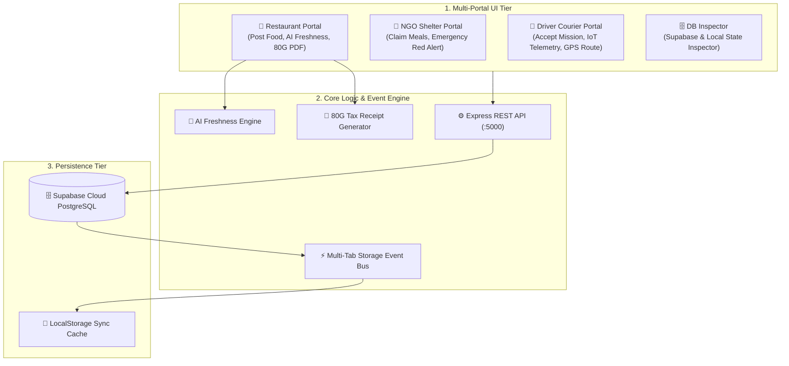

# 🍲 Surplus-To-Shelter: Real-Time Smart Food Rescue Network

> **Connecting Surplus Food Donors, NGO Shelters, and Courier Drivers with AI-Powered Freshness Scoring, IoT Cold-Chain Logistics, & Instant 80G Tax Certificates.**


---

## 📊 Executive Summary & Project Pitch

**Surplus-To-Shelter** is an end-to-end, zero-latency food rescue ecosystem that automates the collection and distribution of edible surplus food from commercial kitchens to verified NGO shelters and community centers.

By integrating **AI-driven safety & freshness scoring**, **IoT thermal cold-chain telemetry**, **NGO emergency crisis dispatch**, and automated **Section 80G Tax Deduction Certificate generation**, Surplus-To-Shelter turns food waste into social impact while incentivizing businesses and couriers.


## 🌟 Detailed Platform Portals & Features

### 1. 🏪 Restaurant & Food Donor Portal
- **Surplus Food Posting (`restaurant-post.html`)**: Simple form to post cooked meals, bakery items, or raw produce with portion counts, weight (kg), and cooking time.
- **AI Freshness Score Calculator**: Dynamically calculates safety risk score (e.g., `98/100 Tier A`) and remaining consumption window.
- **Smart Recipient Matching (`restaurant-matching.html`)**: Recommends nearby verified NGOs based on distance, capacity, dietary preferences (Veg/Non-Veg), and urgent needs.
- **Active Pickup Tracker (`restaurant-pickups.html`)**: Real-time status of assigned courier drivers, live vehicle GPS tracking, and temperature telemetry.
- **ESG Impact & 80G Tax Hub (`restaurant-impact.html`)**: Real-time calculation of tax deductions earned, CO₂ reduced, and 1-click printable PDF 80G tax certificates.

### 2. 🤝 NGO & Shelter Portal
- **Live Food Feed (`ngo-dashboard.html`)**: Real-time catalog of available surplus food batches within city radius.
- **1-Click Food Claiming**: Instant claim mechanism that locks food batches and auto-triggers driver dispatch.
- **Emergency Crisis Broadcast**: Trigger "Red Alert Emergency Requests" (e.g., Severe Weather, Disaster Relief) to request immediate food donations across the city.
- **Intake Log & Safety Verification**: Record temperature upon delivery and confirm food quality receipt.

### 3. 🚚 Driver Courier Portal
- **Open Pickup Market (`driver-available.html`)**: Browse available pickup missions with estimated pay, distance, item weight, and urgency.
- **Active Mission Execution (`driver-active.html`)**: Live delivery execution panel displaying pickup address, shelter dropoff, contact buttons, and thermal sensor gauges.
- **Smart Turn-by-Turn Route (`driver-route.html`)**: Visualized route navigation with real-time ETA update.
- **Earnings & Impact Hub (`driver-impact.html`, `driver-history.html`)**: Track total earnings, base pay, distance allowances, emergency bonuses, and eco-points earned.

### 4. 🗄️ Database Inspector & Dev Gateway (`db-viewer.html`)
- Live inspector to monitor Supabase Cloud PostgreSQL database tables (`users`, `donations`, `pickups`) and local browser sync states.
- 1-click test data seeder and system state reset tool for quick testing and demonstration.

---

## 🛠️ Specialized Technical Engines

### 🧠 1. AI Food Freshness & Expiry Algorithm
Calculates safety ratings using four weighted factors:
1. **Time Elapsed Since Preparation**: Hours elapsed since cooking.
2. **Food Category Risk Factor**: Higher decay rate for dairy/meat vs. baked dry goods.
3. **Ambient Storage Temperature**: Thermal exposure degradation factor.
4. **Packaging Integrity**: Sealed food grade container bonus.

### 📄 2. 80G Tax Certificate PDF Generator (`js/pdf-generator.js`)
- Auto-calculates Fair Market Value (Avg ₹140 per meal portion).
- Computes eligible 50% Section 80G Tax Deduction under Indian Income Tax Act, 1961.
- Generates official, print-ready digital certificates complete with SHA256 verification hash and non-profit trust seal.

### 🚨 3. Emergency Relief Red Alert System (`js/motion.js`)
- Multi-tab storage event bus synchronizes crisis alerts across all active browser windows without full page reloads.
- Renders top-bar emergency red alert banners on donor and driver screens with quick 1-click response buttons.

---

## 📖 Comprehensive Step-by-Step Usage Guide

### Scenario A: How a Restaurant Posts Food & Claims 80G Tax Credit
1. Open the platform at `http://localhost:3000` (or `index.html`) and select **Restaurant Portal**.
2. Go to **Post Surplus Food** (`restaurant-post.html`).
3. Fill in the food details:
   - Item Title (e.g., *50 Meals - Fresh Prepared Rice & Curry*)
   - Food Category (Cooked Meals / Bakery / Dairy / Produce)
   - Portion Count (~50 Meals) & Quantity (35 kg)
   - Preparation Time & Thermal Packaging Status
4. Click **Calculate Freshness & Post Batch**. The system evaluates safety (`98/100 Tier A`).
5. Navigate to **Recipient Matching** (`restaurant-matching.html`) to pick an NGO or let the system auto-assign the closest shelter.
6. Click **Confirm Dispatch**. Courier driver is notified automatically.
7. After delivery, visit **ESG Impact** (`restaurant-impact.html`) and click **Generate 80G Tax Certificate** to download your printable tax receipt (`js/pdf-generator.js`).

### Scenario B: How an NGO Claims Food & Triggers Emergency Relief
1. Open **NGO / Shelter Portal** (`ngo-dashboard.html`).
2. View the **Available Surplus Food Feed**.
3. Click **Claim Food Batch** on any available posting to reserve it for your shelter.
4. **During a Crisis / Emergency**: Click **Trigger Emergency Red Alert** at the top of the dashboard.
5. Select crisis type (e.g., *Heavy Rain Flood Relief*) and required meal portions.
6. This broadcasts a live Red Alert banner across all connected restaurant and driver screens for urgent response.

### Scenario C: How a Courier Driver Accepts & Executes a Delivery
1. Open **Driver Courier Portal** (`driver-dashboard.html`).
2. Go to **Available Pickups** (`driver-available.html`) to review pending rescue missions.
3. Click **Accept Mission**.
4. Switch to **Active Pickup** (`driver-active.html`) to view pickup/dropoff instructions, contact numbers, and thermal container readings (`4.2°C`).
5. Click **Start Navigation** (`driver-route.html`) to view turn-by-turn route instructions.
6. Upon arrival at the shelter, click **Complete Delivery & Verify Seal**. Earnings and Eco-Points will immediately credit to your driver profile.

---

## 🏗️ System Architecture & Data Flow



---

## 📁 Complete Repository Directory Structure

```text
Shelter/
├── index.html                     # Central Portal Switcher & Auth Gateway
├── restaurant-dashboard.html      # Restaurant Main Dashboard & Quick Stats
├── restaurant-post.html           # Surplus Food Posting Form (AI Freshness Score)
├── restaurant-matching.html       # Smart AI NGO Matching Engine
├── restaurant-donations.html      # Active Restaurant Donation Feed
├── restaurant-pickups.html        # Live Driver Dispatch & Vehicle Tracking
├── restaurant-notifications.html  # Alerts & Emergency Crisis Feed
├── restaurant-impact.html         # ESG Impact Dashboard & 80G Tax Certificates
├── restaurant-settings.html       # Restaurant Profile & Pickup Preferences
├── ngo-dashboard.html             # NGO Shelter Claiming & Intake Dashboard
├── driver-dashboard.html          # Driver Active Mission & Earnings Overview
├── driver-available.html          # Driver Open Pickup Market
├── driver-active.html             # Live Delivery & IoT Cold-Chain Monitoring
├── driver-route.html              # Turn-by-Turn Mission Route Guidance
├── driver-history.html            # Driver Delivery History & Payout Log
├── driver-impact.html             # Driver Eco-Points & Community Impact Badges
├── driver-notifications.html      # Real-Time Pickups & Emergency Alerts Feed
├── driver-settings.html           # Driver Profile, Vehicle Info & Pay Preferences
├── db-viewer.html                 # Supabase & Local Database Inspector
├── css/
│   └── animations.css             # Universal Button Spring & Micro-Interactions
├── js/
│   ├── app.js                     # Unified Multi-Portal Navigation & State Controller
│   ├── maps.js                    # Leaflet / Map Route Visualization Helpers
│   ├── motion.js                  # Global Interactivity & Emergency Crisis Sync
│   ├── pdf-generator.js           # 80G Tax Deduction Certificate PDF Generator
│   ├── supabase.js                # Supabase SDK Client & Local Bridge
│   ├── tutorial.js                # Interactive Platform Walkthrough & Guidance
│   └── new-user-cleaner.js        # State Sanitizer for New Test Sessions
├── server/
│   └── index.js                   # Express REST API Backend (:5000)
└── supabase/
    └── schema.sql                 # PostgreSQL Database Schema
```

---

## 🗄️ Database Schema Summary (`supabase/schema.sql`)

- **`users`**: User profiles (`id`, `name`, `email`, `role`, `phone`, `address`).
- **`donations`**: Surplus food records (`id`, `title`, `category`, `quantity_kg`, `portions`, `freshness_score`, `donor_id`, `recipient_id`, `status`).
- **`pickups`**: Delivery dispatch records (`id`, `donation_id`, `driver_id`, `status`, `temp_celsius`, `seal_verified`, `pickup_time`, `delivery_time`).

---

## ⚡ Local Development & Setup

### Prerequisites
- **Node.js** (v18.0 or higher)
- **npm** (v9.0 or higher)

### Step 1: Clone Repository & Install Dependencies
```bash
git clone https://github.com/sachinjatavat/Shelter.git
cd Shelter
npm install
```

### Step 2: Environment Configuration
Create a `.env` file in the root directory:
```env
PORT=5000
SUPABASE_URL=https://your-supabase-project.supabase.co
SUPABASE_ANON_KEY=your-supabase-anon-key
```

### Step 3: Launch Servers
```bash
# Start Vite Frontend Dev Server (Port 3000)
npm run dev

# Start Express Backend Server (Port 5000)
npm run server
```

Open your browser at `http://localhost:3000`.

---

## 👥 Project Team & Credits

Developed with ❤️ for community food security:

- 🌟 **Sachin**
- 🌟 **Krishna**
- 🌟 **Nitesh**
- 🌟 **Priyanshi**

---

## 📜 License

Distributed under the **MIT License**. See `LICENSE` for details.
